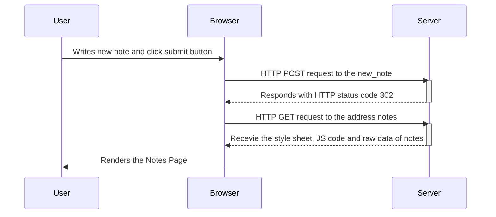

## 0.4 New note diagram

 

```mermaid

sequenceDiagram

    User->>Browser: Writes new note and click submit button
    Browser->>Server: HTTP POST request to the new_note
    activate Server
    Server-->>Browser: Responds with HTTP status code 302
    deactivate Server
    Browser->>Server: HTTP GET request to the address notes
    activate Server
    Server-->>Browser: Recevie the style sheet, JS code and raw data of notes
    deactivate Server
    Browser->>User: Renders the Notes Page

```
