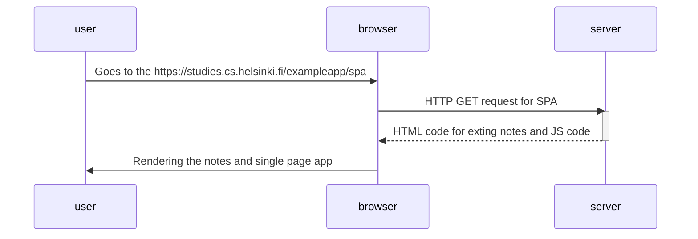

## Single page app diagram

 

```mermaid
sequenceDiagram

    user->>browser: Goes to the https://studies.cs.helsinki.fi/exampleapp/spa
    browser->>server: HTTP GET request for SPA
    activate server
    server-->>browser: HTML code for exting notes and JS code
    deactivate server
    browser->>user: Rendering the notes and single page app


```
