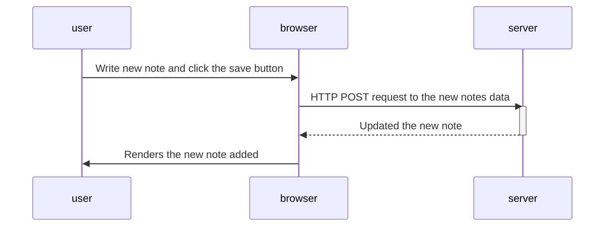

## New note in Single page app diagram

 

```mermaid
sequenceDiagram

    user->>browser: Write new note and click the save button
    browser->>server: HTTP POST request to the new notes data
    activate server
    server-->>browser: Updated the new note
    deactivate server
    browser->>user: Renders the new note added


```
